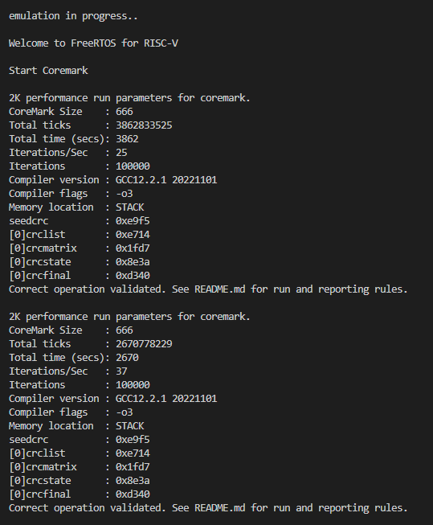

# Evaluating the performance of a virtual machine with an RISC-V core running FreeRTOS using the Coremark

The project is an implementation of Coremark[^1] for testing a 32-bit RISC-V kernel. The kernel is emulated in QEMU and does not depend on specific hardware (i.e. kernel is virtual). Coremark runs as a task for the FreeRTOS[^2] real-time operating system.

The project is based on a modified demo application from the FreeRTOS repository. To run Coremark correctly, the main function from core_main.c was renamed and declared in the coremark.h, which connects to the main function of the project.

## Requirements

1. GNU RISC-V toolchains (tested on Syntacore Development Toolkit — v202212-sp1)
  - https://syntacore.com/page/products/sw-tools
2. GNU Make from Minimalist GNU for Windows (tested on GNU Make — v3.81)
  - https://sourceforge.net/projects/mingw-w64/
3. qemu-system-riscv32 (tested on QEMU emulator — v8.0.2)
  - https://www.qemu.org/download/
4. Windows OS (tested on 22H2 build 19045.3086)


## How to build

Add path of toolchain that is described above section, such as:

```
$ export PATH="/YOUR_PATH/riscv64-unknown-elf/bin:${PATH}"
```

For release build:

```
$ make -C build/gcc/
```

For debug build:

```
$ make -C build/gcc/ DEBUG=1
```

To clean build artifacts:

```
$ make -C build/gcc/ clean
```

If the build was successful, the FreeRTOS_Coremark_RV.elf executable will be located in the build/gcc/output directory.


## How to run

```
$ qemu-system-riscv32 -nographic -machine virt -net none \
  -chardev stdio,id=con,mux=on -serial chardev:con \
  -mon chardev=con,mode=readline -bios none \
  -smp 4 -kernel ./build/gcc/output/FreeRTOS_Coremark_RV.elf
```


## How to build and run automatically

Add path of toolchain that is described above section, such as:

```
$ export PATH="/YOUR_PATH/riscv64-unknown-elf/bin:${PATH}"
```

Run script for the bash shell:

```
./start.sh
```
The script does the following steps:
1. Cleans the build/gcc/output folder after the previous build.
2. Starts the application build.
3. Starts emulation of the project in qemu.


## Description

This application just prints Tx/Rx message of queue to serial port, use no
other hardware and use only primary core (currently hart 0).
Other cores are simply going to wfi state and execute nothing else.

## Execution log

The following information is displayed in the console after the project is launched:



## References

The project uses the following sources:

[^1]: https://github.com/eembc/coremark
1. Coremark
  - https://github.com/eembc/coremark

[^2]: https://github.com/FreeRTOS/FreeRTOS
2. FreeRTOS
  - https://github.com/FreeRTOS/FreeRTOS
